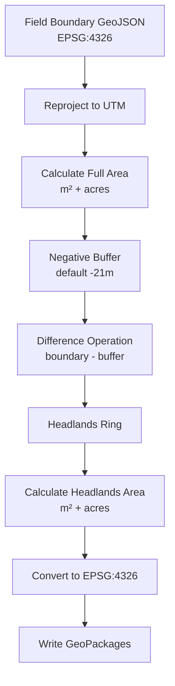

# Headlands Ring Generator

Generate metric-accurate headlands rings from field boundary GeoJSON using UTM reprojection and negative buffering.

## When to use

- When you need accurate headlands (unplanted border strips) for machinery turning calculations
- When field boundaries are in EPSG:4326 but you need metric-area calculations
- When planning variable-rate application that excludes headlands

## How it works



## Outputs

Two GeoPackage files per farm:

1. **`{farm}_headlands_4326.gpkg`** — Headlands ring only, EPSG:4326
   - Ready for web mapping, GIS import, or further analysis
   
2. **`{farm}_headlands_utm.gpkg`** — Multi-layer analysis in UTM
   - Layer: `headlands_analysis` with 3 geometry types:
     - `full_boundary` — original field polygon
     - `inner_buffer` — negative buffer result
     - `headlands_ring` — difference result

## Usage

```bash
# Single farm
python generate_headlands_rings.py --grower-slug iowa-grower --farm-slug iowa-grower-iowa

# All farms
python generate_headlands_rings.py --all

# Custom buffer width
python generate_headlands_rings.py --all --buffer-m -30
```

## Attributes

All output GeoPackages include:
- `field_id` — original field identifier
- `crop_name` — crop type from source
- `state_fips`, `county_fips`, `county_name` — administrative info
- `area_m2` — area in square meters (UTM-calculated, metric-accurate)
- `area_acres` — area in acres
- `geometry_type` — (UTM GPKG only) boundary / inner_buffer / headlands_ring

## Requirements

- geopandas
- shapely
- numpy
- pandas

## Notes

- UTM zone is auto-detected from field centroid
- Fields too small for the negative buffer are skipped with a warning
- Tiny geometry slivers (< 0.1 m²) are filtered out
